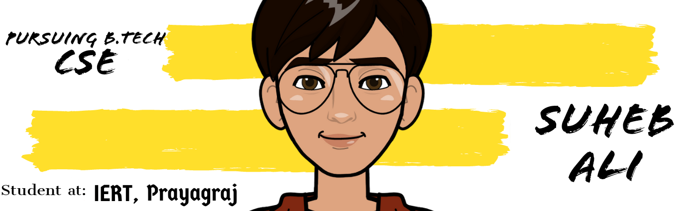

<!--
**ersuheb/ersuheb** is a ✨ _special_ ✨ repository because its `README.md` (this file) appears on your GitHub profile.

Here are some ideas to get you started:

- 🔭 I’m currently working on ...
- 🌱 I’m currently learning ...
- 👯 I’m looking to collaborate on ...
- 🤔 I’m looking for help with ...
- 💬 Ask me about ...
- 📫 How to reach me: ...
- 😄 Pronouns: ...
- ⚡ Fun fact: ...
-->


<!-- <h2 align='center'>Suheb Ali @ ersuheb</h2>
<p align='center'><b>Pursuing B.Tech in CSE from Institute of Engineering and Rural Technology</b></p> -->

<h2>Hey! 👋</h2>

[](https://github.com/ersuheb) [](https://github.com/ersuheb?tab=followers)

I'm Suheb Ali! 
- <i>Currently:</i> Pursuing B.Tech 
- <i>Previously:</i> Diploma in Electrical Egineering

<h2>💻 I'm Currently workng on</h2>

- Updating my skills
- On the way to learn as much as i can


__Check out my GitHub repository:__

<div>
  <p>
    <a href="https://github.com/ersuheb/Placement_Preparation">
      
    </a>
  </p>
</div>

<h2>👀 Stats</h2>

<div>
<!--   <p align="center">
    <b><em>Now listening to:</em></b> <br/>
    
  </p> -->
  
  <p align="center">
  <b><em>GitHub Stats:</em></b> <br/>
     <br/><br/>
  <!-- <b><em>Programming activity (Last 7 days):</em></b> <br/>
     -->

  📊 **this week i spent my time on:**
<!--START_SECTION:waka-->

```text
C++        2 hrs 17 mins   ██████████████████████░░░   87.91 %
Markdown   18 mins         ███░░░░░░░░░░░░░░░░░░░░░░   11.61 %
Python     0 secs          ░░░░░░░░░░░░░░░░░░░░░░░░░   00.44 %
Other      0 secs          ░░░░░░░░░░░░░░░░░░░░░░░░░   00.04 %
```

<!--END_SECTION:waka-->
  </p>
</div>

<h2> About Suheb⚡:</h2>

I'm a Student living in Prayagraj, I am an enthusiastic and social person who loves to take up new challenges and learn new skills. I love meeting new people, exchanging ideas, learn from their experiences and spreading knowledge & positivity. If you are around Prayagraj, drop an email and let's catch-up over Coffee! 

<h2> 👨‍💻 Tech Stack I am Familiar With: </h2>

<p align="center">
<br/>


<br/>
</p>

<!-- - Check out my Blog: 
- Know more about me: [About Suheb](https://ersuheb.com/pages/about) 
- Write to me: [ConnectWith@ersuheb.com](mailto:ConnectWith@ersuheb.com) -->

<h2>📫 How to reach me:</h2>

<a href="mailto:ersuheb@gmail.com"></a> <a href="https://www.linkedin.com/in/ersuheb/"></a> <a href="https://www.instagram.com/ersuheb/"></a> <a href="https://twitter.com/ersuheb"></a>